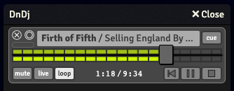

# DnDj

**A multi-featured (and system agnostic) sound mixer/controller for [Foundry VTT](https://foundryvtt.com).**

DnDj is designed to give the GM detailed and flexible control over what is being played and heard.

**Features at launch include -**

- simutalneously cross fade tracks smoothly over variable times (including snap change).

- live volume control, syncing input slider and volume in real time.

- master (GM) and personal (everyone) volume control.

- pause.

- mute.

- pin tracks. When a track in the mix stops, it is automatically remove. Pinned tracks remain. 

- cue tracks to unpause/pause (or if pinned start) on next fade or snap

- sync everyone to the same time elapsed on all tracks (including when a player logs into a session, their audio syncs automatically with the GM's).

- Session memory - the ability to load your last mix.

**Upcoming features -**

- full featured seek within tracks.

- monitoring: allowing the GM to audition tracks and volume changes without the players hearing them.

- control who hears what [ e.g resolve a passive perception check with Alex hearing the approaching orcs but not Maggie or Brian.]

- save multiple sessions and load them on the fly allowing a GM to seamlessly mix between presets for locations, situations or characters. This would result in...

- A console for programming sessions, cues, transitions etc. The mixer becoming an interface for DnDj, not the extent of it. 

**Possible future features -**

- A soundboard. [ This is a little vanilla, but would make sense within the scope of the module.]

- A satelite mixer for players [ e.g Brain is all about the delicate woodland ambience, but on the other hand Maggie wants to drown in the addrenaline of endless synths, sampled choirs and war drums. ]

## NOTES - given the intricate nature of this module, its numerous possible states and the inherently disruptive nature of a sound error - this thing is going to be woobly for a while.
